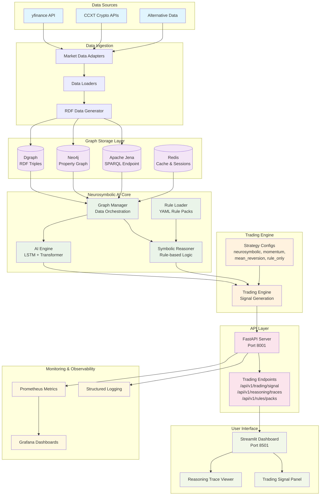
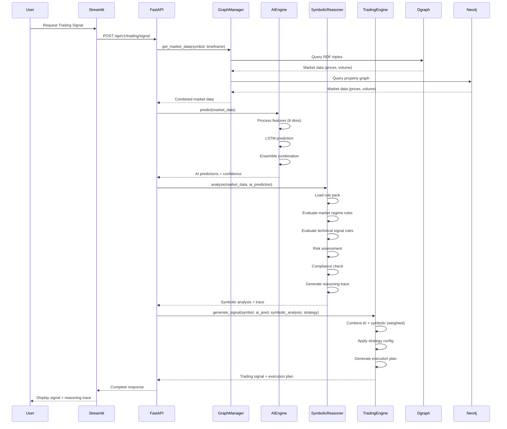
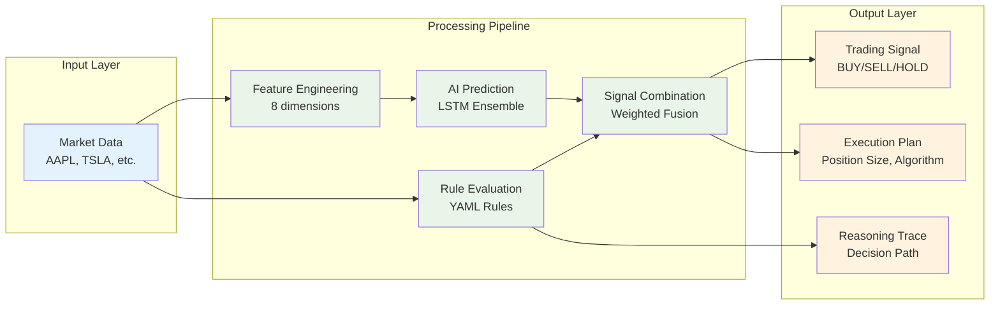
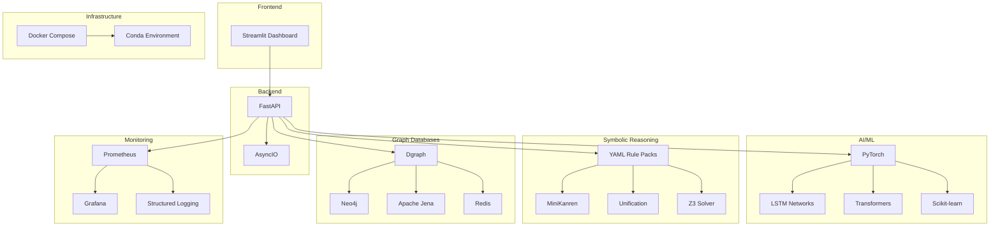

# HFT Neurosymbolic AI System - Architecture Flow Diagram

## System Overview Flow

## Detailed Component Flow

## Data Flow Architecture

## Technology Stack

## Key Features & Capabilities

### ✅ **Implemented Features**
- **Neurosymbolic AI Pipeline**: AI predictions + symbolic reasoning
- **Rule-based Trading**: YAML rule packs with validation
- **Multi-database Support**: Dgraph, Neo4j, Jena, Redis
- **Reasoning Traces**: Complete decision audit trail
- **API Endpoints**: RESTful trading signal generation
- **Docker Orchestration**: Multi-container deployment
- **Monitoring**: Prometheus metrics + Grafana dashboards

### 🔄 **In Progress**
- **Streamlit Dashboard**: Reasoning trace viewer
- **Data Adapters**: yfinance, ccxt integration
- **Neo4j Stabilization**: Memory optimization

### 📋 **Planned Features**
- **Advanced AI Models**: Transformer training
- **Real-time Data**: WebSocket streaming
- **Backtesting**: Historical performance analysis
- **Risk Management**: Position sizing algorithms
- **Compliance**: Regulatory reporting

## System Requirements

- **Python**: 3.10+
- **Memory**: 8GB+ RAM (Neo4j optimized for 256M-512M)
- **Storage**: 10GB+ for data and models
- **Network**: Ports 8001 (FastAPI), 8501 (Streamlit), 8081 (Hasura)
- **Dependencies**: Docker, Conda, PyTorch, Graph databases
