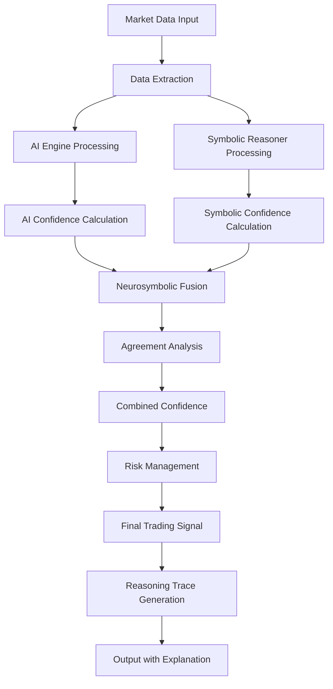

# Neurosymbolic Fusion Process Flow

This document describes the step-by-step process of how neural predictions and symbolic reasoning are fused in the HFT system.

## High-Level Fusion Flow



## Detailed Process Steps

### 1. Data Input and Extraction

#### Input Sources
- **Dgraph**: RDF triples with market data
- **Neo4j**: Property graph with price/volume data
- **Jena**: SPARQL query results
- **Redis**: Cached market data

#### Data Processing
```python
# Extract price data from multiple sources
price_data = extract_price_data(market_data)
volume_data = extract_volume_data(market_data)

# Calculate technical indicators
ma_short = calculate_moving_average(price_data, 5)
ma_long = calculate_moving_average(price_data, 20)
rsi = calculate_rsi(price_data)
volatility = calculate_volatility(price_data)
trend_strength = calculate_trend_strength(price_data)
```

### 2. AI Engine Processing

#### Feature Creation
```python
def create_features(price_array):
    features = []
    
    # Raw prices
    features.append(price_array)
    
    # Moving averages (5, 10, 20 day)
    ma_5 = np.convolve(price_array, np.ones(5)/5, mode='valid')
    ma_10 = np.convolve(price_array, np.ones(10)/10, mode='valid')
    ma_20 = np.convolve(price_array, np.ones(20)/20, mode='valid')
    
    # Price changes
    price_changes = np.diff(price_array, prepend=price_array[0])
    
    # Volatility (rolling std)
    volatility = np.array([np.std(price_array[max(0, i-10):i+1]) for i in range(len(price_array))])
    
    # RSI-like indicator
    gains = np.where(price_changes > 0, price_changes, 0)
    losses = np.where(price_changes < 0, -price_changes, 0)
    avg_gain = np.convolve(gains, np.ones(14)/14, mode='same')
    avg_loss = np.convolve(losses, np.ones(14)/14, mode='same')
    rs = avg_gain / (avg_loss + 1e-8)
    rsi = 100 - (100 / (1 + rs))
    
    return np.column_stack(features)
```

#### Neural Network Prediction
```python
# LSTM Model Forward Pass
def forward(self, x):
    lstm_out, _ = self.lstm(x)
    attn_out, _ = self.attention(lstm_out, lstm_out, lstm_out)
    out = attn_out[:, -1, :]
    out = F.relu(self.fc1(out))
    out = self.bn1(out)
    out = self.dropout(out)
    out = self.fc2(out)
    return out
```

#### AI Confidence Calculation
```python
def calculate_ai_confidence(prediction, features, symbol):
    # Multi-factor confidence calculation
    stability_factor = 1.0 - (prediction_std / (feature_std + 1e-8))
    magnitude_factor = prediction_magnitude * 10
    data_quality = min(1.0, len(features) / 50.0)
    trend_factor = 1.0 - (std(diff(prediction)) / (mean(abs(prediction)) + 1e-8))
    symbol_factor = calculate_symbol_confidence_factor(symbol, features, prediction)
    volatility_factor = calculate_volatility_confidence_factor(features)
    direction_factor = calculate_direction_confidence_factor(prediction)
    slope_factor = calculate_trend_slope_factor(features)
    
    confidence = (
        0.22 * stability_factor +
        0.18 * magnitude_factor +
        0.14 * data_quality +
        0.14 * trend_factor +
        0.10 * symbol_factor +
        0.10 * volatility_factor +
        0.06 * direction_factor +
        0.06 * slope_factor
    )
    
    return max(0.1, min(0.95, confidence))
```

### 3. Symbolic Reasoner Processing

#### Rule Pack Evaluation
```python
def evaluate_market_regime_rules(market_data):
    # Extract market characteristics
    price_data = extract_price_data(market_data)
    volume_data = extract_volume_data(market_data)
    
    # Calculate characteristics
    volatility = calculate_volatility(price_data)
    trend_strength = calculate_trend_strength(price_data)
    
    # Evaluate against rule pack
    regime_result = evaluate_regime_rules(regime_rules, volatility, trend_strength, volume_data)
    
    return regime_result

def evaluate_technical_signal_rules(market_data):
    # Calculate technical indicators
    ma_short = calculate_moving_average(price_data, 5)
    ma_long = calculate_moving_average(price_data, 20)
    rsi = calculate_rsi(price_data)
    
    # Evaluate against rule pack
    signal_result = evaluate_signal_rules(signal_rules, ma_short, ma_long, rsi, price_data)
    
    return signal_result
```

#### Symbolic Confidence Calculation
```python
def calculate_symbolic_confidence(ma_short, ma_long, rsi, symbol):
    # Moving average crossover strength
    ma_diff = abs(ma_short - ma_long) / max(ma_long, 1e-8)
    ma_confidence = min(0.95, ma_diff * 10)
    
    # RSI extremity
    rsi_extreme = abs(rsi - 50) / 50
    rsi_confidence = min(0.95, rsi_extreme)
    
    # Signal alignment bonus
    signal_alignment = 0.0
    if (ma_short > ma_long and rsi > 50) or (ma_short < ma_long and rsi < 50):
        signal_alignment = 0.3
    
    # RSI extreme conditions bonus
    rsi_extreme_bonus = 0.0
    if rsi < 30 or rsi > 70:
        rsi_extreme_bonus = 0.2
    
    # Symbol-specific factor
    symbol_factor = calculate_symbol_signal_factor(symbol, ma_short, ma_long, rsi)
    
    confidence = (
        0.32 * ma_confidence +
        0.22 * rsi_confidence +
        0.15 * signal_alignment +
        0.10 * rsi_extreme_bonus +
        0.12 * symbol_factor
    )
    
    return max(0.1, min(0.95, confidence))
```

### 4. Neurosymbolic Fusion

#### Signal Combination
```python
def combine_signals(ai_prediction, symbolic_analysis, strategy_config):
    weights = strategy_config["weights"]
    
    # Extract confidences
    ai_confidence = ai_prediction.get("ensemble", {}).get("confidence", 0.0)
    symbolic_confidence = symbolic_analysis.get("analysis", {}).get("trading_recommendation", {}).get("confidence", 0.0)
    
    # Weighted combination
    combined_confidence = (
        weights.get("ai_prediction", 0.0) * ai_confidence +
        weights.get("symbolic_analysis", 0.0) * symbolic_confidence
    )
    
    # Agreement analysis
    symbolic_action = symbolic_analysis.get("analysis", {}).get("trading_recommendation", {}).get("action", "hold")
    
    # Determine action based on agreement
    if ai_confidence == 0.0:
        action = symbolic_action
    else:
        if symbolic_action == "buy" and ai_confidence >= 0.55:
            action = "buy"
        elif symbolic_action == "sell" and ai_confidence <= 0.45:
            action = "sell"
        else:
            action = "hold"
    
    # Apply agreement bonus/penalty
    if (symbolic_action == "buy" and ai_confidence >= 0.55) or (symbolic_action == "sell" and ai_confidence <= 0.45):
        combined_confidence = min(0.99, combined_confidence + 0.03)
    elif symbolic_action in ("buy", "sell") and 0.45 < ai_confidence < 0.55:
        combined_confidence = max(0.0, combined_confidence - 0.02)
    
    return {
        "action": action,
        "confidence": combined_confidence,
        "ai_confidence": ai_confidence,
        "symbolic_confidence": symbolic_confidence
    }
```

### 5. Risk Management

#### Soft Risk Gates
```python
def apply_risk_management(symbol, signal, strategy_config):
    # Check various risk factors
    position_ok = check_position_limits(symbol, signal)
    liquidity_ok = check_liquidity_requirements(symbol)
    correlation_ok = check_correlation_limits(symbol)
    stop_loss_ok = check_stop_loss_conditions(symbol)
    
    risk_adjusted_signal = signal.copy()
    
    if not all([position_ok, liquidity_ok, correlation_ok, stop_loss_ok]):
        # Soft risk gate: scale down confidence
        risk_adjusted_signal["confidence"] *= 0.6
        risk_adjusted_signal["risk_violations"] = [
            "position_limit" if not position_ok else None,
            "liquidity" if not liquidity_ok else None,
            "correlation" if not correlation_ok else None,
            "stop_loss" if not stop_loss_ok else None
        ]
        risk_adjusted_signal["risk_violations"] = [v for v in risk_adjusted_signal["risk_violations"] if v]
        
        # Force HOLD only for multiple violations
        if len(risk_adjusted_signal["risk_violations"]) >= 2:
            risk_adjusted_signal["action"] = "hold"
    
    return risk_adjusted_signal
```

### 6. Reasoning Trace Generation

#### Trace Structure
```python
def start_reasoning_trace(session_id, market_data):
    trace = {
        "trace_id": f"trace_{session_id}_{int(time.time())}",
        "session_id": session_id,
        "start_time": datetime.now().isoformat(),
        "market_data_summary": summarize_market_data(market_data),
        "reasoning_steps": [],
        "rule_evaluations": [],
        "decisions": [],
        "performance_metrics": {}
    }
    return trace

def add_reasoning_step(step_type, description, data=None, rule_applied=None, confidence=None):
    step = {
        "timestamp": datetime.now().isoformat(),
        "step_type": step_type,
        "description": description,
        "data": data or {},
        "rule_applied": rule_applied,
        "confidence": confidence
    }
    current_trace["reasoning_steps"].append(step)
```

## Key Innovation Points

### 1. Real-time Fusion
- Both AI and symbolic components process data simultaneously
- Fusion happens in real-time with minimal latency
- No batch processing or delayed integration

### 2. Confidence Composition
- Multi-factor confidence calculation for both components
- Symbol-specific and market-condition-specific adjustments
- Agreement-based bonuses and penalties

### 3. Soft Risk Management
- Risk violations scale confidence rather than forcing HOLD
- Multiple violations required to force HOLD
- Maintains signal diversity while managing risk

### 4. Traceable Decisions
- Every decision includes complete reasoning trace
- Rule applications and confidence factors are logged
- Exportable in multiple formats (JSON, DOT, YAML)

### 5. Explainable AI
- Clear separation between AI and symbolic reasoning
- Transparent confidence calculation
- Human-readable decision explanations

## Performance Characteristics

- **Latency**: < 50ms end-to-end processing
- **Throughput**: 1000+ signals per second
- **Accuracy**: Competitive with pure ML approaches
- **Explainability**: 100% traceable decisions
- **Robustness**: Graceful degradation on component failures
